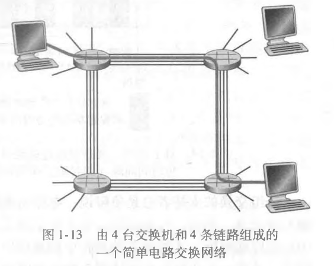
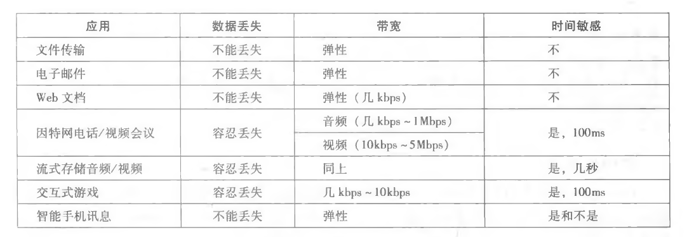
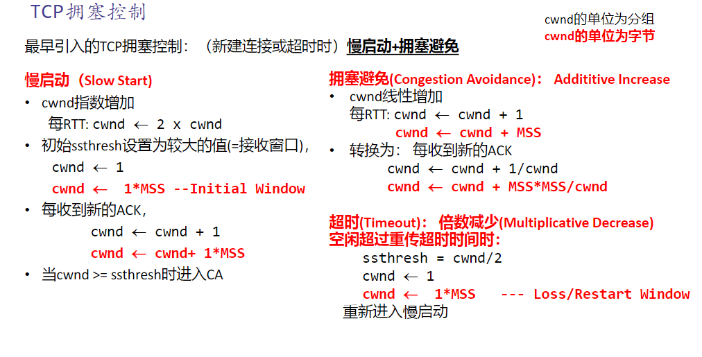
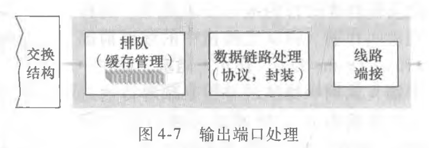

<center><font size=7>Notes</font></center>
<p align='right'>by Nemo</p>
<p align='right'>2023.9.08</p>

# 计算机网络和因特网
## internet
连接到计算机网络的设备被称为主机（host）或端系统（end system）  
端系统通过通信链路（communication link）和分组交换机（packet switch）连接到一起  
当一台端系统要向另一台端系统发送数据时，发送端系统将数据分段，并为每段加上首部字节。由此 形成的信息包用计算机网络的术语来说称为分组（packet）。这些分组通过网络发送到目的端系统，在那里被装配成初始数据  
从发送端系统到接收端系统，一个分组所经历的一系列通信链路和分组交换机称为通过该网络的路径（mute或path）  
端系统通过因特网服务提供商（Internet Service Provider, ISP）接入因特网，包括如本地电缆或电话公司那样的住宅区ISP、公司ISP、大学ISP,在机场、旅馆、咖啡店和其 他公共场所提供WiFi接入的ISP,以及为智能手机和其他设备提供移动接入的蜂窝数据ISP。  
每个ISP自身就是一个由多台分组交换机和多段通信链路组成的网络。  
较低层的ISP通过国家的、国际的较高层ISP （如Level 3 Communica­tions .AT&T、Sprint和NTT）互联起来。较高层ISP是由通过高速光纤链路互联的高速路由器组成的。无论是较高层还是较低层ISP网络，它们每个都是独立管理的，运行着IP协 议，遵从一定的命名和地址规则。  
端系统、分组交换机和其他因特网部件都要运行一系列协议（protocol）,这些协议控 制因特网中信息的接收和发送。TCP （Transmission Control Protocol,传输控制协议）和IP （Internet Protocol,网际协议）是因特网中两个最为重要的协议。IP协议定义了在路由器和端系统之间发送和接收的分组格式。因特网的主要协议统称为TCP/IP。  

因特网应用程序运行在端系统上，即它们并不运行在网络核心中的分组交换机中。尽管分组交换机能够加速端系统之间的数据交换，但它们并不在意作为数据的源或宿的应用程序

运行在一个端系统上的应用程序怎样才 
能指令因特网向运行在另一个端系统上的软件发送数据呢？
与因特网相连的端系统提供了一个套接字接口( socket interface),该接口规定了运行 
在一个端系统上的程序请求因特网基础设施向运行在另一个端系统上的特定目的地程序交 
付数据的方式。因特网套接字接口是一套发送程序必须遵循的规则集合，因此因特网能够 
将数据交付给目的地。


以大家可能熟悉的一个计算机网络协议为例，考虑当你向一个Web服务器发出请求 
（即你在Web浏览器中键入一个Web网页的URL）时所发生的情况。图1・2右半部分显示
了这种情形。首先，你的计算机将向该Web服务器发送一条连接请求报文，并等待回答。 
该Web服务器将最终能接收到连接请求报文，并返回一条连接响应报文。得知请求该 
Web文档正常以后，计算机则在一条GET报文中发送要从这台Web服务器上取回的网页
名字。最后，Web服务器向计算机返回该Web网页（文件）


协议（protocol）定义了在两个或多个通信实体之间交换的报文的格式和顺 
序，以及报文发送和/或接收一条报文或其他事件所采取的动作


## 网络边缘
主机有时又被进一步划分为两类：客户 
（client）和服务器（server）

### 接入网
接入网,这是指将端系统物理连接到其边缘路由器（edge router）的网络。边缘路由器是端系统到任何其他远程端系统的路径上的第一台路由器


今天，宽带住宅接入有两种最流行的类型：数字用户线（Digital Subscriber Line,
DSL）和电缆。住户通常从提供本地电话接入的本地电话公司处获得DSL因特网接入。因
此，当使用DSL时，用户的本地电话公司也是它的ISP


家庭电话线同时承载了数据和传统的电话信号，它们用不同的频率进行编码：
•高速下行信道，位于50kHz到1 MHz频段；
•中速上行信道，位于4kHz到50kHz频段；
•普通的双向电话信道，位于0到4kHz频段。
这种方法使单根DSL线路看起来就像有3根单独的线路一样，因此一个电话呼叫和一个因特网连接能够同时共享DSL链路。

DSL标准定义了多个传输速率，包括12Mbps下行和1.8Mbps上行传输速率［ITU
1999］,以及55Mbps下行和15Mbps ±行传输速率［ITU 2006］。因为这些上行速率和下行
速率是不同的，所以这种接入被称为是不对称的

因为在这个系统中应用了光纤
和同轴电缆，所以它经常被称为混合光纤同轴（Hybrid Fiber Coax, HFC）系统


在用户一侧，一个分配器把到达家庭的数据信号和电话信号分隔开，并将数据信号转发给DSL调制 
解调器。在电话公司一侧，在本地中心局中，DSLAM把数据和电话信号分隔开，并将数 
据送往因特网。数百甚至上千个家庭与同一个DSLAM相连


电缆因特网接入的一个重要特征是共享广播媒体。特别是，由头端发送的每个分组向 
下行经每段链路到每个家庭；每个家庭发送的每个分组经上行信道向头端传输。因此，如
果几个用户同时经下行信道下载一个视频文件，每个用户接收视频文件的实际速率将大大 
低于电缆总计的下行速率。
而另一方面，如果仅有很少的活跃用户在进行Web冲浪，则 
每个用户都可以以全部的下行速率接收Web网页，因为用户们很少在完全相同的时刻请 
求网页。因为上行信道也是共享的，需要一个分布式多路访问协议来协调传输和避免碰 
撞


尽管DSL和电缆网络当前代表了超过85%的美国住宅宽带接入，但一种提供更高速 
率的新兴技术是光纤到户(Fiber To The Home, FTTH) [FTTH Council 2016] o顾名思义, 
FTTH概念简单，从本地中心局直接到家庭提供了一条光纤路径


进行
这种分配有两种有竞争性的光纤分布体系结构:«||
主动光纤网络（Active Optical Network,
AON)和被动光纤网络(Passive Optical Network, P0N)

这里，我们简要讨论一下PON,该技术用于Verizon的FIOS服务中。图1・7显示了使
用PON分布体系结构的FTTH。每个家庭具有一个光纤网络端接器(Optical Network Termi・ 
nator, ONT),它由专门的光纤连接到邻近的分配器(splitter) o该分配器把一些家庭(通 
常少于100个)集结到一根共享的光纤，该光纤再连接到本地电话和公司的中心局中的光 
纤线路端接器(Optical Line Tenninator, OLT) 0该OLT提供了光信号和电信号之间的转 
换，经过本地电话公司路由器与因特网相连。在家庭中，用户将一台家庭路由器(通常是 
无线路由器)与ONT相连，并经过这台家庭路由器接入因特网。在PON体系结构中，所 
有从OLT发送到分配器的分组在分配器(类似于一个电缆头端)处复制。


还可采用另外两种接入网技术为家庭提供因特网接入。在无法提供DSL、电缆和
FTTH的地方（例如在某些乡村环境），能够使用卫星链路将住宅以超过1Mbps的速率与 
因特网相连。StarBand和HughesNet是两家这样的卫星接入提供商。  
使用传统电话线的拨 
号接入与DSL基于相同的模式：家庭的调制解调器经过电话线连接到ISP的调制解调器。
与DSL和其他宽带接入网相比，拨号接入56kbps的慢速率是令人痛苦的

企业（和家庭）接入：以太网和WiFi

在公司和大学校园以及越来越多的家庭环境中，使用局域网（LAN）将端系统连接到
边缘路由器


比特当从源到目的地传输时，通过一系列“发射器-接收器”对。对于每个发射
器-接收器对, 通过跨越一种物理媒体 (physical medium) 传播电磁波或光脉冲来发送该
比特。该物理媒体可具有多种形状和形式，并且对沿途的每个发射器-接收器对而言不必 
具有相同的类型。物理媒体的例子包括双绞铜线、同轴电缆、多模光纤缆、陆地无线电频
谱和卫星无线电频谱。物理媒体分成两种类型：导引型媒体(guided media)和非导引型
媒体 (unguided media) o对于导引型媒体, 电波沿着固体媒体前行，如光缆、双绞铜线或
同轴电缆。对于非导引型媒体，电波在空气或外层空间中传播，例如在无线局域网或数字 
卫星频道中。


双绞铜线
最便宜并且最常用的导引型传输媒体是双绞铜线。一百多年来，它一直用于电话网。 
事实上，从电话机到本地电话交换机的连线超过99%使用的是双绞铜线。我们多数人在自
己家中和工作环境中已经看到过双绞线。双绞线由两根绝缘的铜线组成，每根大约lmm 
粗，以规则的螺旋状排列着。这两根线被绞合起来，以减少邻近类似的双绞线的电气干 
扰。通常许多双绞线捆扎在一起形成一根电缆，并在这些双绞线外面覆盖上保护性防护 
层。一对电线构成了一个通信链路。无屏蔽双绞线(Unshielded Twisted Pair, UTP)常用 
在建筑物内的计算机网络中，即用于局域网(LAN)中。目前局域网中的双绞线的数据速 
率从10Mbps到10Gbpso所能达到的数据传输速率取决于线的粗细以及传输方和接收方之 
间的距离


光纤
光纤是一种细而柔软的、能够导引光脉冲的媒体，每个脉冲表示一个比特。一根光 
纤能够支持极高的比特速率，高达数十甚至数百Gbpso它们不受电磁干扰，长达100km 
的光缆信号衰减极低，并且很难窃听。这些特征使得光纤成为长途导引型传输媒体，特 
别是跨海链路。在美国和别的地方，许多长途电话网络现在全面使用光纤。光纤也广泛 
用于因特网的主干。然而，高成本的光设备，如发射器、接收器和交换机，阻碍光纤在 
短途传输中的应用，如在LAN或家庭接入网中就不使用它们。光载波(Optical Carrier, 
0C)标准链路速率的范围从51.8Mbps到39. 8Gbps；这些标准常被称为OCm,其中的 
链路速率等于nx51.8Mbpso目前正在使用的标准包括OC・1、0C・3、0012、0024、 
0048、0096、OC・192、0C-768o ［ Mukherjee 2006 ； Ramaswami 2010］提供了光纤网 
络各方面的知识


陆地无线电信道
无线电信道承载电磁频谱中的信号。它不需要安装物理线路，并具有穿透墙壁、提供
与移动用户的连接以及长距离承载信号的能力，因而成为一种有吸引力的媒体。无线电信 
道的特性极大地依赖于传播环境和信号传输的距离。环境上的考虑取决于路径损耗和遮挡 
衰落（即当信号跨距离传播和绕过/通过阻碍物体时信号强度降低）、多径衰落（由于干 
扰对象的信号反射）以及干扰（由于其他传输或电磁信号）
陆地无线电信道能够大致划分为三类：一类运行在很短距离（如1米或2米）；另一
类运行在局域，通常跨越数十到几百米；第三类运行在广域，跨越数万米。个人设备如无 
线头戴式耳机、键盘和医疗设备跨短距离运行；在1・2. 1节中描述的无线LAN技术使用了
局域无线电信道；蜂窝接入技术使用了广域无线电信道。我们将在第7章中详细讨论无线 
电信道。


## 网络核心
通过网络链路和交换机移动数据有两种基本方法：电路交换（circuit switching）和分组交换（packet switching）。
### 分组交换
在各种网络应用中，端系统彼此交换报文（message）。报文能够包含协议设计者需
要的任何东西。报文可以执行一种控制功能，也可以包含数据，例如电子邮件数据、JPEG图像或MP3音频文件。  
为了从源端系统向目的端系统发送一个报文，源将长报文划分为较小的数据块，称之为分组 
（packet） 。在源和目的地之间，每个分组都通过通信链路和分组交换机（packet switch ） 
传送。（交换机主要有两类：路由器（router）和链路层交换机（link-layer* switch）。）分组 以等于该链路最大传输速率的速度传输通过通信链路。因此，如果某源端系统或分组交换 机经过一条链路发送一个 R 比特的分组，链路的传输速率为 R 比特/秒，则传输该分组的时间为L/R秒

#### 存储转发传输
存储转发传输是指在交换机能够开始向输岀链路传输该分组的第一个比特之前，必须接收到整个分组  
因此分组交换机需要缓存准备转发的分组


#### 排队时延和分组丢失
排队时延：如果到达的分组需要传输到某条链路，但发现该链路正忙于传输其他分组，该到达分组必须在输出缓存中等待  
排队时延是变化的，变化的程度取决于网络的拥塞程度。因为缓存空间的大小是有限的，一个到达的分组可能发现该缓存已被其他等待传输的分组完全充满了。在此情况下，将出现分组丢失（丢包）（packet loss）,到达的分组或已经排队的分组之一将被丢弃

#### 转发表和路由选择协议
IP地址：在因特网中，每个端系统具有一个称为IP地址的地址。  
当源主机要向目的端系统发送一个分组时，源在该分组的首部包含了目的地的IP地址  
每台路由器具有一个转发表(forwarding table),用于将目的地址(或目的地址的一部分)映射成为输岀链路。当某分组到达一台路由器时，路由器检查该地址，并用这个目的地址搜索其转发表，以发现适当的出链路。路由器则将分组导向该出链路  
转发表如何配置？路由选择协议  

### 电路交换
在电路交换网络中，在端系统间通信会话期间，预留了端系统间沿路径通信所需要的资源（缓存，链路传输速率）。

主机A为了向主机B发
送报文，网络必须在两条链路的每条上先预留一条电路  
因为每条链路具有4条电路，对于由端到端连接所使用的每条链路而言，该连接在连接期间获得链路总传输容量的1/4。例如, 如果两台
邻近交换机之间每条链路具有1Mbps传输 速率，则每个端到端电路交换连接获得250kbps专用的传输速率  
// 电路交换中，网络要为建立通信的两端建立特定的、独有的电路，这条电路不能被其他用户挪用
#### 电路交换网络中的复用
链路中的电路是通过频分复用 (Frequency- Division Multiplexing, FDM )或时分复用（Time-Division Multiplexing, TDM）来实现的。

对于TDM, 一条电路的传输速率等于帧速率乘以一个时隙中的比特数量。例如，如果链路每秒传输8000个帧，每个时隙由8个比特组成，则每条电路的传输速率是64kbps。  
电路交换的弊端：
- 静默期（silent period）：建立连接但不交换数据的时间，这样网络资源就被拜拜浪费了
- 传播速率与链路数量无关

### 分组交换与电路交换的对比
- 分组交换更有效率：电路交换不考虑需求，而预先分配了传输链路的使用，这使得已分配而并不需要的链路时间未被利用。另一方面，分组交换按需分配链路使用。链路传输能力将在所有需要在链路上传输分组的用户之间逐分组地被共享
  - 用户不总是在是使用网络。在用户数量增多的情况下，电路交换的效率下降得更快，因为必须为每个用户提供预留一定的带宽；而分组交换能更好地分配资源
  - 如果某个用户突然产生巨大的数据流动，那么电路交换的时间将会大大延长，因为无法将分配给其他用户的带宽挪用过来

### 网络的网络
我们通过接入ISP（Internet Service Provider）实现与其他用户互联，但是不可能ISP为每两个接入的用户之间建立通信链路，这样成本太高

#### 网络的几个结构
##### 网络结构1
用单一的全球传输ISP互联所有接入ISP。该网络不仅跨越全球，而且 
至小具有一台路由器靠近数十万接入ISP中的每一个。当然，对于全球传输ISP,建造这样一个大规模的网络将耗资巨大。为了有利可图，自然要向每个连接的接入ISP收费，其价格反映（并不一定正比于）一个接入ISP经过全球ISP交换的流量大小。
##### 网络结构2
由数十万接入ISP和多个全球传输ISP组成  
接入ISP无疑喜欢网络结构2胜过喜欢网络结构1,因为它们现在能够根据价格和服务因素在多个竞争的全球传输提供商之间进行选择。然而，值得注意的是，这些全球传输ISP之间必须是互联的；不然的话，与某个全球传输ISP连接的接入ISP将不能与连接到其他全球传输ISP的接入ISP进行通信
##### 网络结构3
多层结构：  
- 第一层ISP：实现全球互联的一层，在网络结构的顶层；第一层ISP并不唯一，而是有很多家处于互相竞争的状态
- 区域ISP：在任何给定的区域，可 能有一个区域ISP (regional ISP)，区域中的接入ISP与之连接。每个区域ISP则与第一层ISP (tier-1 ISP)连接。同样区域ISP也不是唯一的，也是多家竞争
- 区域ISP下面还可以再继续细分为区域ISP。。。

在这样的等级结构中，每个接入ISP向其连接的区域ISP支付费用，并且每个区域ISP向它连接的第一层ISP支付费用。(一个接入1SP也能直接与第一层ISP 连接，这样它就向第一层1SP付费。)因此，在这个等级结构的每一层，都有客户-提供商关系。  
第一层ISP不向任何人付费，因为它们位于该等级结构的顶部。 
更为复杂的情况是，在某些区域，可能有较大的区域ISP (可能跨越整个国家)，该区域中较小的区域ISP与之相连，较大的区域ISP则与第一层ISP连接  
例如，在中国，每个城市有接入ISP,它们与省级ISP连接，省级ISP又与国家级ISP连接，国家级ISP最终与 第一层ISP连接［Tian2012］。

#### 存在点(Point of Presence, PoP)、多宿
一个POP只是提供商网络中的一台或多台路由器(在相同位置)群组，其中客户ISP能够与提供商ISP连接  
PoP存在于等级结构的所有层次，但底层(接入ISP)等级除外  
多宿：一个ISP（除了第一层ISP）选择和多个提供商ISP连接  
当一个ISP多宿时，即使它的提供商之一出现故障，它仍然能够继续发送和接收分组

#### 对等
位于相同等级结构层次的邻近一对ISP，直接将它们的网络连到一起，使它们之间的所有流量经直接连接而不是通过上游的中间ISP传 输  
当两个ISP对等时，通常不进行结算，即任一个ISP不向其对等付费

#### IXP
沿着这些相同路线，第三方公司能够创建一个因特网交换点(Internet Exchange Point, IXP) , IXP是一个汇合点，多个ISP 
能够在这里一起对等。IXP通常位于一个有自己的交换机的独立建筑物中［Ager 2012］, 在今天的因特网中有400多个IXP。

#### 网络结构4
由接入ISP、区域ISP、第一层ISP、PoP、多宿、对等和IXP组成

#### 网络结构5
在网络结构4顶部增加内容提供商网络(content provider network )构建而成

比如谷歌，在公立因特网之外创立了属于自己的专用网络，这就属于内容提供商网络

### 分组交换网中的时延、丢包和吞吐量
#### 节点时延
##### 时延类型
- 处理时延：
  - 检查分组首部
  - 决定将该分组导向何处
  - 检查比特级别的差错所需要的时间
- 排队时延：等待其他分组传输的延迟
- 传输时延：将分组的所有bit推上传输链路所需的时间
- 传播时延：数据在链路上传播的延迟，取决于链路的物理性质
- 总时延：以上4种时延之和


##### 排队时延
假定所有分组都是由L比特组成的  
令a表示分组到达队列的平均速率（a的单位是分组/秒，即pkt/s）  
R是传输速率，即从队列中推出比特的速率（以bps即b/s为单位）  
流量强度La/R：比特到达的速率除以被推出的速率  
如果La/R>l,则比特到达队列的平均速率超过从该队列传输岀去的速率，那么分组排队队列将会一直增大趋向于无穷。因此，流量工程中的一条金科玉律是：设计系统时流量强度不能大于1。
现在考虑La/R<=1时的情况。  
- 如果分组周期性地到达，即每L/R秒到达一个分组，则每个分组将到达一个空队列中，不会有排队时延。  
- 突发到达：假定每（L/R）* N秒同时到达N个分组，即每隔（L/R）* N时间到达N个分组，则传输第k个分组有(k-1)*L/R的时延
- 随机到达：随着流量强度接近于1，平均排队时延迅速增加。


##### 丢包
排队容量是有限的，当队列满的时候，新到达的分组将会被**丢弃**  
分组丢失的比例随着流量强度增加而增加。因此，一个节点的性能常常不仅根据时延来度量，而且根据丢包的概率来度量

#### 端到端时延

N为传播次数，即对应中间有N-1台路由器  

#### traceroute
跟踪源和目的端系统之间的路由器，返回它们的信息，包括域名、地址、延迟

#### 吞吐量
瓶颈链路：链路速率最低的链路  
一个在服务器和客户之间具有N条链路的网络，这N条链路的传输速率分别是R1，...，Rn，从服务器到客户的文件传输吞吐量是min{R1，R2，...，Rn}，这同样仍是沿着服务器和客户之间路径的瓶颈链路的速率（近似，未考虑存储转发、处理时延和协议等问题） 
 
考虑多个客户-服务器系统，那么共享链路的流量将会被分配，这时吞吐量还取决于干扰流量  

## 协议层次及其服务模型
将这些综合起来，各层的所有协议被称为协议栈（protocol stack） o因特网的协议栈由5个层次组成：物理层、链路层、网络层、运输层和应用层。

### 5层协议栈
- 应用层：应用层是网络应用程序及它们的应用层协议存留的地方；
  - HTTP、SMTP、FTP协议，
  - 域名系统（DNS）
- 运输层：因特网的运输层在应用程序端点之间传送应用层报文；
  - 运输协议TCP、UDP
- 网络层：因特网的网络层负责将称为数据报（datagram）的网络层分组从一台主机移动到另一台主机；
  - 网际协议IP
- 链路层：为了将分组从一个节点（主机或路由器）移动到路径上的下一个节点，网络层必须依靠该链路层的服务；
  - 链路层的例子包括以太网、WiFi和电缆接入网的DOCSIS协议；
  - 链路层分组称为帧
- 物理层：物理层的任务是将该帧中的一个个比特从一个节点移动到下一个节点
  - 在这层中的协议仍然是链路相关的，并且进一步与该链路（例如，双绞铜线、单模光纤）的实际传输媒体相关
  
### 7层OSI
附加了两个层：表示层和会话层
- 表示层：表示层的作用是使通信的应用程序能够解释交换数据的含义。这些服务包括数据压缩和数据加密（它们是自解释的）以及数据描述（这使得应用程序不必担心在各台计算机中表示/存储的内部格式不同的问题）
- 会话层：会话层提供了数据交换的定界和同步功能，包括了建立检查点和恢复方案的方法。

### 封装

在每一层，一个分组具有两种类型的字段：首部字段和有效载荷字段（payload field）。有效载荷通常是来自上一层的分组  
图中M对应有效载荷，多个H对应首部字段，
包括运输层报文段、网络层数据报、链路层帧，分别由运输层、网络层、链路层生成  

### 网络攻击
- 病毒：需要某种形式的用户交互来感染用户设备的恶意软件
- 蠕虫：无须任何明显用户交互就能进入设备的恶意软件；新近感染设备中的蠕虫则能扫描因特网，搜索其他运行相同网络应用程序的易受感染的主机。当它发现其他易受感染的主机时，便向这些主机发送一个它自身的副本

#### 拒绝服务攻击（DoS attack）
- 弱点攻击。这涉及向一台目标主机上运行的易受攻击的应用程序或操作系统发送制作精细的报文。如果适当顺序的多个分组发送给一个易受攻击的应用程序或操作系统，该服务器可能停止运行，或者更糟糕的是主机可能崩溃。
- 带宽洪泛。攻击者向目标主机发送大量的分组，分组数量之多使得目标的接入链路变得拥塞，使得合法的分组无法到达服务器。
- 连接洪泛。攻击者在目标主机中创建大量的半开或全开TCP连接。该主机因这些伪造的连接而陷入困境，并停止接受合法的连接。

#### 分组嗅探器
在无线传输设备的附近放置一台被动的接收机，该接收机就能得到传输的每个分组的副本  
这些分组包含了各种敏感信息，包括口令、社会保险号、商业秘密和隐秘的个人信息。  
记录每个流经的分组副本的被动接收机被称为分组嗅探器

# Chap 2
## 应用层体系结构
主要为两种：客户-服务器体系结构、对等（P2P）体系结构

### 客户-服务器体系结构
有一个总是打开的主机称为服务器，它服务于来自许多其他称为客户的主机的请求  
当Web服务器接收到来自某客户对某对象的请求时，它向该客户发送所请求的对象作为响应  
客户相互之间不直接通信  
服务器具有固定的、周知的地址，该地址称为IP地址
> 配备大量主机的数据中心（data center）常被用于创建强大的虚拟服务器

### P2P 体系结构
应用程序在间断连接的主机对之间使用直接通信，这些主机对被称为对等方  
这些对等方并不为服务提供商所有，相反却为用户控制的桌面机和膝上机所有，大多数对等方驻留在家庭、大学和办公室   

### 混合式
结合了客户-服务器和P2P的元素。例如，对于许多即时讯息应用而言，服务器被用于跟踪用户的IP地址，但用户到用户的报文在用户主机之间（无须通过中间服务器）直接发送

## 进程通信
### 客户和服务器进程
在一对进程之间的通信会话场景中，发起通信（即在该会话开始时发起与其他进程的联系）的进程被标识为``客户``，在会话开始时等待联系的进程是``服务器``

### 进程与计算机网络之间的接口
进程通过一个称为套接字（socket）的软件接口向网络发送报文和从网络接收报文

由于该套接字是建立网络应用程序的可编程接口，因此套接字也称为应用程序和网络之间的应用程序编程接口  
在发送端的应用程序将报文推进该套接字。在该套接字的另一侧，运输层协议负责从接收进程的套接字得到该报文。
应用程序开发者可以控制套接字在应用层端的一切，但是对该套接字的运输层端几乎没有控制权  
应用程序开发者对于运输层的控制仅限于：
- 选择运输层协议；
- 也许能设定几个运输层参数，如最大缓存和最大报文段长度等

### 进程寻址
在因特网中，主机由其IP地址(IP address)标识  
IP地址是一个32比特的量且它能够唯一地标识该主机  
除了知道报文发送目的地的主机地址外，发送进程还必须指定运行在接收主机上的接收进程(更具体地说，接收套接字)。因为一般而言一台主机能够运行许多网络应用, 这些信息是需要的。``目的地端口号``(port number)用于这个目的

### 可供应用程序使用的运输服务
包括因特网在内的很多网络提供了不止一种运输层协议。当开发一个应用时，必须选择一种可用的运输层协议。  
通过研究这些可用的运输层协议所提供的服务，选择一个最能为你的应用需求提供恰当服务的协议

#### 应用程序服务要求
分类：可靠数据传输、吞吐量、定时和安全性
- 可靠数据传输：必须做一些工作以确保由应用程序的一端发送的数据正确、完全地交付给该应用程序的另一端。一个运输协议提供这种服务时，发送进程只要将其数据传递进套接字，就可以完全相信该数据将能无差错地到达接收进程
- 吞吐量：要求运输层协议能够以某种特定的速率提供确保的可用吞吐量
- 定时：对端到端的时延有约束
- 安全性：比如，在发送主机中，运输协议能够加密由发送进程传输的所有数据，在接收主机中，运输层协议能够在将数据交付给接收进程之前解密这些数据；比如，运输协议能提供除了机密性以外的其他安全性服务，包括数据完整性和端点鉴别

### 因特网提供的运输服务
因特网（更一般的是TCP/IP网络）为应用程序提供两个运输层协议，即UDP和TCP。  
当你（作为一个软件开发者）为因特网创建一个新的应用时，首先要做出的决定是，选择UDP还是选择TCP

#### TCP服务

TCP服务模型包括面向连接服务和可靠数据传输服务。当某个应用程序调用TCP作为其运输协议时，该应用程序就能获得来自TCP的这两种服务。
- 面向连接的服务：在应用层数据报文开始流动之前，TCP让客户和服务器互相交换运输层控制信息。这个所谓的握手过程提醒客户和服务器，让它们为大量分组的到来做好准备。在握手阶段后，一个TCP连接（TCP connection）就在两个进程的套接字之间建立了。这条连接是全双工的，即连接双方的进程可以在此连接上同时进行报文收发。当应用程序结束报文发送时，必须拆除该连接。
- 可靠的数据传送服务：通信进程能够依靠TCP，无差错、按适当顺序交付所有发送的数据。当应用程序的一端将字节流传进套接字时，它能够依靠TCP将相同的字节流交付给接收方的套接字，而没有字节的丢失和冗余。

> TCP协议还具有拥塞控制机制。当发送方和接收方之间的网络出现拥塞时，TCP的拥塞控制机制会抑制发送进程（客户或服务器）。

##### TCP安全
无论TCP还是UDP都没有提供任何加密机制，这就是说发送进程传进其套接字的数据，与经网络传送到目的进程的数据相同。所以数据就可能在任何中间链路被嗅探。  
所以因特网界已经研制了 TCP的加强版本，称为安全套接字层（Secure Sockets Layer, ``SSL``）  
用SSL加强后的TCP不仅能够做传统的TCP所能做的一切，而且提供了关键的进程到进程的安全性服务，包括加密、数据完整性和端点鉴别  
SSL的加强需要在应用层上实现。如果一个应用程序要使用SSL的服务，它需要在该应用程序的客户端和服务器端包括SSL代码。  
当一个应用使用SSL时，发送进程向SSL套接字传递明文数据；在发送主机中的SSL则加密该数据并将加密的数据传递给TCP套接字。加密的数据经因特网传送到接收进程中的TCP套接字。该接收套接字将加密数据传递给SSL，由其进行解密。最后，SSL通过它的SSL套接字将明文数据传递给接收进程。

#### UDP服务
UDP是一种不提供不必要服务的轻量级运输协议，它仅提供最小服务。
- UDP是无连接的，因此在两个进程通信前没有握手过程。
- UDP协议提供一种不可靠数据传送服务，也就是说，当进程将一个报文发送进UDP套接字时，UDP协议并不保证该报文将到达接收进程。不仅如此，到达接收进程的报文也可能是乱序到达的。
- UDP没有包括拥塞控制机制，所以UDP的发送端可以用它选定的任何速率向其下层（网络层）注入数据


### 应用层协议
应用层协议（application-layer protocol）定义了运行在不同端系统上的应用程序进程如何相互传递报文，包括：
- 交换的报文类型，例如请求报文和响应报文。
- 各种报文类型的语法，如报文中的各个字段及这些字段是如何描述的。
- 字段的语义，即这些字段中的信息的含义。
- 确定一个进程何时以及如何发送报文，对报文进行响应的规则。

#### HTTP
Web的应用层协议是超文本传输协议（HyperText Transfer Protocol, HTTP）,它是Web的核心，在［RFC 1945］和［RFC 2616］（RFC文档）中进行了定义
##### Web页面
由``对象``构成  
一个对象（object）只是一个文 件，诸如一个HTML文件、一个JPEG图形、一个Java小程序或一个视频片段这样的文件，且它们可通过一个``URL``地址寻址
多数Web页面含有一个HTML基本文件（base HTML file，也是对象）以及几个引用对象。
HTML基本文件通过对象的URL地址引用页面中的其他对象。  
每个URL地址由两部分组成：存放对象的服务器主机名和对象的路径名。例如,URL地址http://www.someSchool.edu/someDepartment/pic­ture.gif,其中的 www.someSchool.edu 就是主机名，/someDepartment/picture.gif 就是路径名。Web服务器（Webserver）实现了 HTTP 的服务器端，它用于存储Web对象，每个对象由URL寻址。流行的Web服务器有Apache和Microsoft Internet Information Server （微软互联网信息服务器）  
当用户请求一个Web页面服务器发出对该页面中所包含对象的 HTTP 请求报文，服务器接收到请求并用包含这些对象的 HTTP 响应报文进行响应

HTTP使用TCP作为它的支撑运输协 议。HTTP客户首先发起一个与服务器的TCP连接。一旦连接建立，该浏览器和服务器进程就可以通过套接字接口访问TCP。
##### HTTP是一个无状态协议
服务器向客户发送被请求的文件，而不存储任何关于该客户的状态信息。假如某个特定的客户在短短的几秒内两次请求同一个对象，服务器并不会因为刚刚为该客户提供了该对象就不再做出反应，而是重新发送该对象，就像服务器已经完全忘记不久之前所做过的事一样。因为HTTP服务器并不保存关于客户的任何信息。
##### Web使用了客户服务器应用程序体系结构
Web服务器总是打开的，具有一个固定的IP地址，且它服务于可能来自数以百万计的不同浏览器的请求

#### 非持续连接和持续连接
非持续连接：每个请求/响应对是经一个单独的TCP连接发送
持续连接：所有的请求及其响应经相同的TCP连接发送
##### 非持续连接
每个TCP连接在服务器发送一个对象后关闭，即该连接并不为其他的对象而持续下来。  
每个TCP连接只传输一个请求报文和一个响应报文。  
产生多个TCP连接时，可以通过并行缩短响应时间、
> 往返时间（Round-Trip Time, RTT）：一个短分组从客户到服务器然后再返回客户所花费的时间。RTT包括分组传播时延、分组在中间路由器和交换机上的排队时延以及分组处理时延


缺点：
- 必须为每一个请求的对象建立和维护一个全新的连接。对于每个这样的连接，在客户和服务器中都要分配TCP的缓冲区和保持TCP变量，这给Web服务器带来了严重的负担
- 每一个对象经受两倍RTT的交付时延，即一个RTT用于创建TCP,另一个RTT用于请求和接收一个对象
##### 持续连接
服务器在发送响应后保持该TCP连接打开。在相同的客户与服务器之间，后续的请求和响应报文能够通过相同的连接进行传送  
不必一个对象一个对象地发送，而是可以一次性发送整个甚至多个web页面（包含多个对象） 
对于对象的请求可以一个接一个地发出，而不必等待对未决请求（流水线）的回答
一般来说，如果一条连接经过一定时间间隔（一个可配置的超时间隔）仍未被使用，HTTP服务器就关闭该连接

#### HTTP报文格式
##### 请求报文

HTTP请求报文的第一行叫作请求行（request line）,其后继的行叫作首部行（header line）  
- 请求行有3个字段：方法字段、URL字段和HTTP版本字段  
  - 方法字段：GET POST HEAD PUT DELETE
- 首部行：
  - Host指明对象所在的主机
  - Connection: close要求服务器在发送完被请求的对象后就关闭这条连接
  - User-agent指明用户代理，即向服务器发送请求的浏览器的类型
  - Accept-language表示用户想得到该对象的语言版本（如果服务器中有这样的对象的话）；否则，服务器应当发送它的默认版本


当使用POST方法时，下面的实体体才起作用  
- HEAD方法类似于GET方法。当服务器收到一个使用HEAD方法的请求时，将会用一个HTTP报文进行响应，但是并不返回请求对象。
- PUT方法常与Web发行工具联合使用，它允许用户上传对象到指定的Web服务器上指定的路径（目录）。
- PUT方法也被那些需要向Web服务器上传对象的应用程序使用。
- DELETE方法允许用户或者应用程序删除Web服务器上的对象

##### 响应报文

三部分：初始状态行（status line），首部行（headerline），实体体（entity body）  
- 第一行为状态行：有3个字段：协议版本字段、状态码和相应状态信息
> 状态码：
> 
- 首部行：
  - Connection: close首部行告诉客户，发送完报文后将关闭该TCP连接
  - Date：首部行指示服务器从它的文件系统中检索到该对象，将该对象插入响应报文，并发送该响应报文的时间
  - Server:首部行指示该报文是由一台Apache Web服务器产生的
  - Last-Modified:首部行指示了对象创建或者最后修改的日期和时间
  - Content-Length：首部行指示了被发送对象中的字节数
  - Content-Type:首部行指示了实体体中的对象是HTML文本

#### 用户与服务器的交互：cookie

cookie：服务器用于识别用户身份

#### Web缓存
Web缓存器（Web cache）也叫代理服务器（proxy server）  
Web缓存器有自己的磁盘存储空间，并在存储空间中保存最近请求过的对象的副本  
一旦某浏览器被配置，每个对某对象的浏览器请求首先被定向到该Web缓存器。举例来说，假设浏览器正在请求对象http://www.someschool.edu/campus.gif，将会发生如下情况：
1. 浏览器创建一个到Web缓存器的TCP连接，并向Web缓存器中的对象发送一个HTTP请求
2. Web缓存器进行检查，看看本地是否存储了该对象副本。如果有，Web缓存器就向客户浏览器用HTTP响应报文返回该对象
3. 如果Web缓存器中没有该对象，它就打开一个与该对象的初始服务器（即www.someschool.edu）的TCP连接。Web缓存器则在这个缓存器到服务器的TCP连接上发送一个对该对象的HTTP请求。在收到该请求后，初始服务器向该Web缓存器发送具有该对象的HTTP响应
4. 当Web缓存器接收到该对象时，它在本地存储空间存储一份副本，并向客户的浏览器用HTTP响应报文发送该副本（通过现有的客户浏览器和Web缓存器之间的TCP连接）

值得注意的是Web缓存器既是服务器又是客户。当它接收浏览器的请求并发回响应时，它是一个服务器。当它向初始服务器发出请求并接收响应时，它是一个客户。  
> Web缓存器有点像cache

好处：
- 首先，Web缓存器可以大大减少对客户请求的响应时间，特别是当客户与初始服务器之间的瓶颈带宽远低于客户与Web缓存器之间的瓶颈带宽时更是如此。如果在客户与Web缓存器之间有一个高速连接（情况常常如此），并且如果用户所请求的对象在Web缓存器上，则Web缓存器可以迅速将该对象交付给用户。
- 其次，Web缓存器能够大大减少一个机构的接入链路到因特网的通信量。通过减少通信量，该机构（如一家公司或者一所大学）就不必急于增加带宽，因此降低了费用。此外，Web缓存器能从整体上大大减低因特网上的Web流量，从而改善了所有应用的性能。

#### 条件GET方法
请求报文：
```
If-Modified-Since：<date>
```
仅当自指定日期之后该对象被修改过，才发送该对象  
相应报文（如果没修改）：状态行会加上Not Modified

#### 电子邮件
一个典型的邮件发送过程是：从发送方的用户代理（比如personal computer）开始，传输到发送方的邮件服务器，再传输到接收方的邮件服务器，然后在这里被分发到接收方的邮箱中。  
`SMTP`是因特网电子邮件中主要的应用层协议。它使用TCP可靠数据传输服务，从发送方的邮件服务器向接收方的邮件服务器发送邮件
##### SMTP
SMTP 一般不使用中间邮件服务器发送邮件，即使这两个邮件服务器位于地球的两端也是这样。假设发送方的邮件服务器在中国香港，而接收方的服务器在美国圣路易斯，那么这个TCP连接也是从香港服务器到圣路易斯服务器之间的直接相连。特别是，如果接收方的邮件服务器没有开机，该报文会保留在发送方的邮件服务器上并等待进行新的尝试，这意味着邮件并不在中间的某个邮件服务器存留

Alice的用户代理用SMTP将电子邮件报文推入她的邮件服务器，接着她的邮件服务器（作为一个SMTP客户）再用SMTP将该邮件中继到Bob的邮件服务器。  
值得注意的是Bob的用户代理不能使用SMTP得到报文，因为取报文是一个拉操作，而SMTP协议是一个推协议。通过引入一个特殊的邮件访问协议来解决这个难题，该协议将Bob邮件服务器上的报文传送给他的本地PC。HTTP可以做到。
##### SMTP与HTTP
共同点：
- 这两个协议都用于从一台主机向另一台主机传送文件：HTTP从Web服务器向Web客户（通常是一个浏览器）传送文件（也称为对象）；SMTP从一个邮件服务器向另一个邮件服务器传送文件（即电子邮件报文）
- 当进行文件传送时，持续的HTTP和SMTP都使用持续连接

不同点：
- HTTP主要是一个拉协议（pull protocol），即在方便的时候，某些人在Web服务器上装载信息，用户使用HTTP从该服务器拉取这些信息。特别是TCP连接是由想接收文件的机器发起的。SMTP基本上是一个推协议（push protocol）,即发送邮件服务器把文件推向接收邮件服务器。特别是，这个TCP连接是由要发送该文件的机器发起的
- SMTP要求每个报文（包括它们的体）采用7比特ASCII码格式。如果某报文包含了非7比特ASCII字符（如具有重音的法文字符）或二进制数据（如图形文件），则该报文必须按照7比特ASCII码进行编码。HTTP数据则不受这种限制
- HTTP把每个对象封装到它自己的HTTP响应报文中, 而SMTP则把所有报文对象放在一个报文之中
##### 邮件访问协议
比如POP3 IMAP  
基于Web的电子邮件：用户代理就是普通的浏览器，用户和他远程邮箱之间的通信通过HTTP进行

## DNS
识别主机有两种方式，通过主机名（www.google.com）或者IP地址（121.7.106.83）  
人们喜欢便于记忆的主机名标识方式，而路由器则喜欢定长的、有着层次结构的IP地址。为了折中这些不同的偏好，我们需要一种能进行主机名到IP地址转换的目录服务。这就是域名系统（Domain Name System, DNS）的主要任务  
DNS是：
- 一个由分层的DNS服务器（DNS server）实现的分布式数据库；
- 一个使得主机能够查询分布式数据库的应用层协议。

DNS服务器通常是运行 BIND（Berkeley Internet Name Domain）软件的UNIX机器。  
DNS协议：
- DNS服务器采用端口号53，支持UDP和TCP协议
- 区域传输一般采用TCP
- DNS查询一般采用UDP，无需建立连接，可以支持更多的用户
  - 采用UDP传输的DNS消息限制为512字节，如果超过512字节，多余的部分会被截掉
  - 可采用TCP再次查询，首先发送两个字节的整数, 给出了接下来发送的DNS消息的长度
### 转换顺序
用户主机要将服务器的主机名转换为IP地址
1. 运行DNS应用的客户端
2. 将主机名传给DNS应用的客户端
3. DNS客户向DNS服务器发送一个包含主机名的请求
4. DNS客户最终会收到一份回答报文，其中含有对应于该主机名的IP地址
5. 一旦浏览器接收到来自DNS的该IP地址，它能够向位于该IP地址80端口的HTTP服务器进程发起一个TCP连接

### DNS其他服务
- 主机别名（host aliasing）。有着复杂主机名的主机能拥有一个或者多个别名。主机别名（当存在时）比主机规范名更加容易记忆。应用程序可以调用DNS来获得主机别名对应的规范主机名以及主机的IP地址。
- 邮件服务器别名（mail server aliasing）。电子邮件应用程序可以调用DNS,对提供的主机名别名进行解析，以获得该主机的规范主机名及其IP地址。
- DNS也用于在冗余的服务器之间进行负载分配。繁忙的站点被冗余分布在多台服务器上,每台服务器均运行在不同的端系统上，每个都有着不同的IP地址。由于这些冗余的Web服务器，一个IP地址集合因此与同一个规范主机名相联系。DNS数据库中 存储着这些IP地址集合。当客户对映射到某地址集合的名字发出一个DNS请求时，该服务器用IP地址的整个集合进行响应，但在每个回答中循环这些地址次序。因为客户通常总是向IP地址排在最前面的服务器发送HTTP请求报文，所以DNS就在所有这些冗余的Web服务器之间循环分配了负载。DNS的循环同样可以用于邮件服务器，因此，多个邮件服务器可以具有相同的别名。

### DNS工作机理概述
#### 分布式、层次数据库
没有一台DNS服务器拥有因特网上所有主机的映射。相反, 这些映射分布在所有的DNS服务器上。  
大致说来，有3种类型的DNS服务器：根DNS 服务器、顶级域(Top-Level Domain, TLD) DNS服务器和权威DNS服务器  

- 根DNS服务器。根名字服务器提供TLD服务器的IP地址
- 顶级域(DNS)服务器。对于每个顶级域(如com、org、net、edu和gov)和所有家的顶级域(如uk、fr、ca和jp),都有TLD服务器(或服务器集群)。TLD服务器提供了权威DNS服务器的IP地址
- 权威DNS服务器。在因特网上具有公共可访问主机（如Web服务器和邮件服务器）的每个组织机构必须提供公共可访问的DNS记录，这些记录将这些主机的名字映射为IP地址。

#### 本地DNS服务器
主机的本地DNS服务器通常“邻近”本主机  
当主机发岀DNS请求时，该请求被发往本地DNS服务器，它起着代理的作用，并将该请求转发到DNS服务器层次结构中（有点像邮件系统中的发送邮件的服务器，起到代理的作用）
#### DNS缓存
在一个请求链中，当某DNS服务器接收一个DNS回答(例如，包含某主机名到IP地址的映射)时，它能将映射缓存在本地存储器中  
由于主机和主机名与IP地址间的映射并不是永久的，DNS服务器在一段时间后(通常设置为两天)将丢弃缓存的信息  
本地DNS服务器也能够缓存TLD服务器的IP地址，因而允许本地DNS绕过查询链中的根DNS服务器。事实上，因为缓存，除了少数DNS查询以外，根服务器被绕过了

#### DNS记录和报文
资源记录(Resource Record,RR)是一个包含了下列字段的4元组：(Name, Value, Type, TTL)
TTL是该记录的生存时间，它决定了资源记录应当从缓存中删除的时间  
根据Type，解析Name和Value
- Type=A，则Name=主机名，Value=IP地址
- Type=NS，则Name为一个域，Value是个知道如何获得该域中主机IP地址的权威DNS服务器的主机名
- Type=CNAME，则Value是别名为Name的主机对应的规范主机名
- Type=MX，则Value是个别名为Name的邮件服务器的规范主机名
> 为了获得邮件服务器的规范主机名，DNS客户应当请求一条MX记录；而为了获得其他服务器的规范主机名，DNS客户应当请求CNAME记录

##### DNS报文
DNS只有查询和回答报文。  

- 前12byte为首部。标识符16bit，用于标识该查询；标志4bit；还有4个有关数量的字段。
  - “查询/回答”标志位1bit，0为查询报文，1为回答报文；
  - “权威的”标志位1bit
  - “希望递归”标志位1bit
  - “递归可用”标志位1bit
- 问题区域包含着正在进行的查询信息。该区域包括：
  - 名字字段，包含正在被查询的主机名字；
  - 类型字段，指出有关该名字的正被询问的问题类型，例如主机地址 是与一个名字相关联（类型A）还是与某个名字的邮件服务器相关联（类型MX）
- 回答区域包含了对最初请求的名字的RR(Resource Record)。在回答报文的回答区域中可以包含多条RR，因为一个主机名能够有多个IP地址
- 权威区域包含了其他权威服务器的记录
- 附加区域包含了其他有帮助的记录

##### 在DNS数据库中插入记录
DNS协议中添加了一个更新（UPDATE）选项，允许通过DNS报文对数据库中的内容进行动态添加或者删除

## P2P
### P2P体系结构的扩展性
对等方除了是比特的消费者外还是它们的重新分发者
大大减少客户-服务器体系结构的分发时间，把服务器向所有客户传输文件转化为一条“传输链”，每个对等方都向另一个对等方发送文件副本。前者分发时间关于客户数量呈线性关系，后者趋于常数（在客户数量不大的情况下）
### BitTorrent
BitTorrent是一种用于文件分发的流行P2P协议

## 视频流和内容分发网
### 因特网视频
视频是一系列的图像, 通常以一种恒定的速率来展现。一幅未压缩、数字编码的图像由像素阵列组成，其中每个像素是由一些比特编码来表示亮度和颜色。  
视频的一个重要特征是它能够被压缩，因而可用比特率来权衡视频质量。今天现成的压缩算法能够将一个视频压缩成所希望的任何比特率。当然，比特率越高，图像质量越好，用户的总体视觉感受越好
我们也能使用压缩生成相同视频的多个版本，每个版本有不同的质量等级。用户则能够根据他们当前可用带宽来决定观看哪个版本
### HTTP 流和 DASH
流式视频应用接收到视频就进行播放，同时缓存该视频后面部分的帧  
经HTTP的动态适应性流(`Dynamic Adaptive Streaming over HTTP, DASH`)：在DASH中，视频编码为几个不同的版本，其中每个版本具有不同的比特率，对应于不同的质量水平。客户动态地请求来自不同版本且长度为几秒的视频段数据块。当可用带宽量较高时，客户自然地选择来自高速率版本的块；当可用带宽量较低时，客户自然地选择来自低速率版本的块
### 内容分发网
内容分发网（`Content Distribution Network, CDN`）：CDN管理分布在多个地理位置上的服务器，在它的服务器中存储视频（和其他类型的Web内容，包括文档、图片和音频）的副本，并且所有试图将每个用户请求定向到一个将提供最好的用户体验的CDN位置  
CDN通常采用两种不同的服务器安置原则：
- 通过在遍及全球的接入ISP中部署服务器集群来深入到ISP的接入网中。其目标是靠近端用户，通过减少端用户和CDN集群之间（内容从这里收到）链路和路由器的数量，从而改善了用户感受的时延和吞吐量
-  在少量关键位置建造大集群。CDN通常将它们的集群放置在因特网交换点（IXP）。

CDN可能不希望将每个视频的副本放置在每个集群中，因为某些视频很少观看或仅在某些国家中流行。事实上，许多CDN没有将视频推入它们的集群，而是使用一种简单的拉策略：如果客户向一个未存储该视频的集群请求某视频，则该集群检索该视频（从某中心仓库或者从另一个集群），向客户流式传输视频时的同时在本地存储一个副本。类似于因特网缓存，当某集群存储器变满时，它删除不经常请求的视频

## 套接字编程：生成网络应用
### UDP套接字编程
e.g.
1. 客户从其键盘读取一行字符(数据)并将该数据向服务器发送。
2. 服务器接收该数据并将这些字符转换为大写。
3. 服务器将修改的数据发送给客户。
4. 客户接收修改的数据并在其监视器上将该行显示出来


UDPCIient.py
```python
from socket import *

serverName = "hostname"
serverPort = 12000
clientSocket = socket(AF_INET, SOCK_DGRAM)
message = raw_input("Input lowercase sentence:")
clientSocket.sendto(message.encode(), (serverName, serverPort))
modifiedMessage, serverAddress = clientSocket.recvfrom(2048)
print(modifiedMessage.decode())
clientSocket.close()
```
UDPServer.py
```python
from socket import *

serverPort = 12000
serverSocket = socket(AF_INET, SOCK_DGRAM)
serverSocket.bind(("", serverPort))
print("The server is ready to receive")
while True:
    message, clientAddress = serverSocket.recvfrom(2048)
    modifiedMessage = message.decode().upper()
    serverSocket.sendto(modifiedMessage.encode(), clientAddress)
```

### TCP套接字编程


TCPClient.py
```python
from socket import *

serverName = "servername"
serverPort = 12000
clientSocket = socket(AF_INET, SOCK_STREAM)
clientSocket.connect((serverName, serverPort))
sentence = raw_input("Input lowercase sentence:")
clientSocket.send(sentence.encode())
modifiedSentence = clientSocket.recv(1024)
print("From Server: ", modifiedSentence.decode())
clientSocket.close()
```
TCPServer.py
```python
from socket import *

serverPort = 12000
serverSocket = socket(AF_INET, SOCK_STREAM)
serverSocket.bind(("", serverPort))
serverSocket.listen(1)
print("The server is ready to receive")
while True:
    connectionSocket, addr = serverSocket.accept()
    sentence = connectionSocket.recv(1024).decode()
    capitalizedSentence = sentence.upper()
    connectionSocket.send(capitalizedSentence.encode())
    connectionSocket.close()
```

# Chap 3
## 运输层
### 运输层和网络层的关系
运输层在应用层和网络层之间  
网络层提供主机之间的逻辑通信，而运输层提供运行在不同主机上的应用程序之间的逻辑通信。
即使底层网络协议是不可靠的，也就是说网络层协议会使分组丢失、篡改和冗余，运输协议也能为应用程序提供可靠的数据传输服务。即使网络层不能保证运输层报文段的机密性，运输协议也能使用加密来确保应用程序报文不被入侵者读取
### 运输层的两个主要协议
TCP & UDP  
UDP和TCP最基本的责任是，将两个端系统间IP的交付服务扩展为运行在端系统上的两个进程之间的交付服务
## 多路复用与多路分解
一个进程(作为网络应用的一部分)有一个或多个套接字(socket),它相当于从网络向进程传递数据和从进程向网络传递数据的门户  
在接收主机中的运输层实际上并没有直接将数据交付给进程，而是将数据交给了一个中间的套接字
### 多路分解
每个运输层报文段中具有几个字段。在接收端，运输层检查这些字段，标识出接收套接字，进而将报文段定向到该套接字。将运输层报文段中的数据交付到正确的套接字的工作称为多路分解(demultiplexing)
### 多路复用
在源主机从不同套接字中收集数据块，并为每个数据块封装上首部信息(这将在以后用于分解)从而生成报文段，然后将报文段传递到网络层，所有这些工作称为多路复用(multiplexing)  
运输层多路复用要求：
- 套接字有唯一标识符； 
- 每个报文段有特殊字段来指示该报文段所要交付到的套接字
#### 端口号
16bit端口号的范围是0~65535  
0 ~ 1023范围的端口号称为周知端口号(well-known port number),是受限制的，这是指它们保留给诸如HTTP (它使用端口号80)和FTP(它使用端口号21)之类的周知应用层协议来使用
#### 多路分解服务
在主机上的每个套接字能够分配一个端口号，当报文段到达主机时，运输层检査报文段中的目的端口号，并将其定向到相应的套接字。然后报文段中的数据通过套接字进入其所连接的进程
#### UDP套接字
UDP套接字由一个IP地址和一个端口号唯一地标识  
如果两个UDP报文段有不同的源IP地址或源端口号，但具有相同的目的IP地址和目的端口号，那么这两个报文段将通过相同的目的套接字被定向到相同的目的进程
#### TCP套接字
TCP套接字由一个四元组唯一地标识：源IP地址、源端口号、目的IP地址和目的端口号  
与UDP不同的是，两个具有不同源IP地址或源端口号的到达TCP报文段将被定向到两个不同的套接字，除非TCP报文段携带了初始创建连接的请求
##### TCP连接建立请求
一条连接建立请求只不过是一个目的端口号为12000, TCP首部的特定“连接建立位”置位的TCP报文段。这个报文段也包含一个由客户选择的源端口号
## 无连接运输：UDP
### UDP概述
UDP只是做了运输协议能够做的最少工作。除了复用/分解功能及少量的差错检测外，它几乎没有对IP增加别的东西  
使用UDP时，在发送报文段之前，发送方和接收方的运输层实体之间没有握手。正因为如此，UDP被称为是无连接的
### UDP优点
- 关于发送什么数据以及何时发送的应用层控制更为精细：采用UDP时，只要应用进程将数据传递给UDP, UDP就会将此数据打包进UDP报文段并立即将其传递给网络层。而TCP有一个拥塞控制机制，以便当源和目的主机间的一条或多条链路变得极度拥塞时来遏制运输层TCP发送方。TCP仍将继续重新发送数据报文段直到目的主机收到此报文并加以确认，而不管可靠交付需要用多长时间。实时应用通常要求最小的发送速率，不希望过分地延迟报文段的传送，且能容忍一些数据丢失，TCP服务模型并不是特别适合这些应用的需要
- 无连接性：UDP不需要在发送数据之前先建立连接。应用进程只需要知道接收方的IP地址和端口号，就可以直接把数据发送过去。这样就减少了开销，提高了效率。
- 无连接状态：TCP需要在端系统中维护连接状态。此连接状态包括接收和发送缓存、拥塞控制参数以及序号与确认号的参数。另一方面，UDP不维护连接状态，也不跟踪这些参数。因此，某些专门用于某种特定应用的服务器当应用程序运行在UDP之上而不是运行在TCP上时，一般都能支持更多的活跃客户
- 分组首部开销小：UDP的首部开销只有8个字节，而TCP的首部开销有20个字节。
### 运行在UDP上的应用程序
- DNS
- SNMP
### UDP缺点
- UDP没有拥塞机制。
- UDP提供的是不可靠服务。

### UDP报文段结构
# Chap 3
## 运输层
### 运输层和网络层的关系
运输层在应用层和网络层之间  
网络层提供主机之间的逻辑通信，而运输层提供运行在不同主机上的应用程序之间的逻辑通信。
即使底层网络协议是不可靠的，也就是说网络层协议会使分组丢失、篡改和冗余，运输协议也能为应用程序提供可靠的数据传输服务。即使网络层不能保证运输层报文段的机密性，运输协议也能使用加密来确保应用程序报文不被入侵者读取
### 运输层的两个主要协议
TCP & UDP  
UDP和TCP最基本的责任是，将两个端系统间IP的交付服务扩展为运行在端系统上的两个进程之间的交付服务
## 多路复用与多路分解
一个进程(作为网络应用的一部分)有一个或多个套接字(socket),它相当于从网络向进程传递数据和从进程向网络传递数据的门户  
在接收主机中的运输层实际上并没有直接将数据交付给进程，而是将数据交给了一个中间的套接字
### 多路分解
每个运输层报文段中具有几个字段。在接收端，运输层检查这些字段，标识出接收套接字，进而将报文段定向到该套接字。将运输层报文段中的数据交付到正确的套接字的工作称为多路分解(demultiplexing)
### 多路复用
在源主机从不同套接字中收集数据块，并为每个数据块封装上首部信息(这将在以后用于分解)从而生成报文段，然后将报文段传递到网络层，所有这些工作称为多路复用(multiplexing)  
运输层多路复用要求：
- 套接字有唯一标识符； 
- 每个报文段有特殊字段来指示该报文段所要交付到的套接字
#### 端口号
16bit端口号的范围是0~65535  
0 ~ 1023范围的端口号称为周知端口号(well-known port number),是受限制的，这是指它们保留给诸如HTTP (它使用端口号80)和FTP(它使用端口号21)之类的周知应用层协议来使用
#### 多路分解服务
在主机上的每个套接字能够分配一个端口号，当报文段到达主机时，运输层检査报文段中的目的端口号，并将其定向到相应的套接字。然后报文段中的数据通过套接字进入其所连接的进程
#### UDP套接字
UDP套接字由一个IP地址和一个端口号唯一地标识  
如果两个UDP报文段有不同的源IP地址或源端口号，但具有相同的目的IP地址和目的端口号，那么这两个报文段将通过相同的目的套接字被定向到相同的目的进程
#### TCP套接字
TCP套接字由一个四元组唯一地标识：源IP地址、源端口号、目的IP地址和目的端口号  
与UDP不同的是，两个具有不同源IP地址或源端口号的到达TCP报文段将被定向到两个不同的套接字，除非TCP报文段携带了初始创建连接的请求
##### TCP连接建立请求
一条连接建立请求只不过是一个目的端口号为12000, TCP首部的特定“连接建立位”置位的TCP报文段。这个报文段也包含一个由客户选择的源端口号
## 无连接运输：UDP
### UDP概述
UDP只是做了运输协议能够做的最少工作。除了复用/分解功能及少量的差错检测外，它几乎没有对IP增加别的东西  
使用UDP时，在发送报文段之前，发送方和接收方的运输层实体之间没有握手。正因为如此，UDP被称为是无连接的
### UDP优点
- 关于发送什么数据以及何时发送的应用层控制更为精细：采用UDP时，只要应用进程将数据传递给UDP, UDP就会将此数据打包进UDP报文段并立即将其传递给网络层。而TCP有一个拥塞控制机制，以便当源和目的主机间的一条或多条链路变得极度拥塞时来遏制运输层TCP发送方。TCP仍将继续重新发送数据报文段直到目的主机收到此报文并加以确认，而不管可靠交付需要用多长时间。实时应用通常要求最小的发送速率，不希望过分地延迟报文段的传送，且能容忍一些数据丢失，TCP服务模型并不是特别适合这些应用的需要
- 无连接性：UDP不需要在发送数据之前先建立连接。应用进程只需要知道接收方的IP地址和端口号，就可以直接把数据发送过去。这样就减少了开销，提高了效率。
- 无连接状态：TCP需要在端系统中维护连接状态。此连接状态包括接收和发送缓存、拥塞控制参数以及序号与确认号的参数。另一方面，UDP不维护连接状态，也不跟踪这些参数。因此，某些专门用于某种特定应用的服务器当应用程序运行在UDP之上而不是运行在TCP上时，一般都能支持更多的活跃客户
- 分组首部开销小：UDP的首部开销只有8个字节，而TCP的首部开销有20个字节。
### 运行在UDP上的应用程序
- DNS
- SNMP
### UDP缺点
- UDP没有拥塞机制。
- UDP提供的是不可靠服务。

### UDP报文段结构

长度字段指示了在UDP报文段的字节数(首部加数据)  
检验和检查在该报文段中是否出现了差错

#### UDP检验和
- 所有16bit的字段使用回卷相加,即将所有16bit字段相加,将溢出位回卷到低位
- 将最后结果取反,作为校验和

这样在接收方接收到UDP报文段时,也将所有16bit字段和校验和相加,如果结果为0xffff,则说明没有出现差错,否则说明出现了差错

## 可靠数据传输原理
可靠数据传输的框架为上层实体提供的服务抽象是：数据可以通过一条可靠的信道进行传输。借助于可靠信道，传输数据比特就不会受到损坏或丢失，而且所有数据都是按照其发送顺序进行交付。这恰好就是TCP向调用它的因特网应用所提供的服务模型

### 可靠数据传输协议(rdt)
#### rdt1.0
假设信道是完全可靠的，即不会发生比特差错、丢包或乱序。在这种情况下，发送方只需简单地将数据传递给接收方，而接收方只需简单地从信道中接收数据。这种协议称为rdt1.0
#### rdt2.0
假设信道可能会发生比特差错。在这种情况下，发送方必须向发送的数据添加冗余，以便接收方能够检测出差错。接收方必须能够纠正差错。这种协议称为rdt2.0  
我们眼下还将继续假定所有 
发送的分组(虽然有些比特可能受损)将按其发送的顺序被接收
##### 自动重传请求(Automatic Repeat reQuest, ARQ)协议
三种协议功能:
- 差错检测
- 接收方反馈:肯定确认(ACK),否定确认(NAK)
- 超时重传

> 停等协议：发送方在发送分组后，停止发送，处于等待状态，直到它从接收方收到一个ACK/NAK。当发送方处于等待状态的时候，它不能从上层获取更多的数据；当发送方收到ACK后，它回到等待来自上层的数据的状态。这种协议称为停等协议。
##### ACK/NAK分组受损
ACK/NAK分组受损怎么办？ 
其中一种方法是：接收方在收到一个受损的ACK/NAK分组时，重传当前数据分组。  
但是这样引入了新的问题：接收方无法事先知道接收到的分组时新的还是上一次的重传。如果发送方收到一个受损的ACK，而又进行一次重传，那么接收方将收到两个相同的分组。    
解决方法：几乎所有现有的数据传输协议中，包括TCP，在数据分组中添加一新字段，让发送方对其数据分组编号，即将发送数据分组的序号（sequence number）放在该字段。重传则分组编号一致。新分组序号和老分组不同。此新字段1bit足够，因为只需区分是新的分组还是重传分组。一般的做法是0，1交替出现，如果前一个分组是0，后一个分组则是1；如果前一个分组是1，后一个分组则是0。  
##### rdt2.1


##### rdt2.2
只有ACK分组，没有NAK分组，在ACK中也包含分组序号字段，发送方根据ACK报文中的分组序号字段来判断是否需要重传分组。  
具体来说，根据当前分组序号，ACK报文也被分为ACK 0和ACK 1两种类型。如果需要发送一个否定确认时，就发送一个当前分组的前一个分组的序号对应的ACK分组。当发送方接收到不对应的ACK分组时，就知道接收方没有正确接收。  


##### rdt3.0
解决丢包问题，即接收不到分组的问题。当发送方等待了一段时间都没有接收到ACK响应时，它便确认分组已丢失，于是重传该分组。  
等待时间的确定：实践中采取的方法是发送方明智地选取一个时间值，来判定是否发送丢包。即使没有丢包，重传也不会造成错误，因为有序号字段的存在来处理冗余分组的情况。如果出现过早超时的情况（只要超时不是太离谱，不横跨两个分组），接收到  
为了实现基于时间的重传机制，需要一个倒计数定时器（countdown timer），在一个给定的时间量过期后，可中断发送方。  
由于分组序号在0和1之间交替，所以rdt3.0协议别称为比特交替协议（alternating-bit protocol）


> rdt3.0如果发现ACK序号不对，就会`什么都不做`，直到超时重传，并不会立马重传，这样可以避免在过早超时的情况下，因为难以区分是上一个分组的接收确认还是分组受损的ACK而不断发送冗余分组。需要保证重传不会带来错误。

### 流水线可靠数据传输协议
停等协议的弊端：数据传输效率低，即使有很快的数据链路，但是因为在停等的过程中什么都做不了，所以实际传输速率会远低于数据链路的速率。  
解决办法是采用流水线。不等待ACK，而是继续发送分组。  
- 必须增加序号范围，以便区分不同的分组
- 协议的发送方和接收方要缓存多个分组
- 需要解决差错恢复，有两种办法：回退N步和选择重传

#### 回退N步协议（GBN）
在流水线中未确认的分组数不能超过最大允许数N。  

将基序号（base）定义为最早未确认分组的序号，将下一个序号（nextseqnum）定义为最小的未使用序号（即下一个待发分组的序号）  
大于或等于base + N的序号是不能使用的，直到当前流水线中未被确认的分组（特别是序号为base的分组）已得到确认为止。  
已被发送但还未被确认的分组的许可序号范围可以被看成是一个在序号范围内长度为N的窗口。随着协议的运行，该窗口在序号空间向前滑动。因此，N常被称为窗口长度（window size） , GBN协议也常被称为滑动窗口协议（sliding-window protocol）
##### 发送方  
GBN发送方必须响应三种类型的事件：
- 上层的调用。当上层调用rdt.send()希望发送数据时，发送方首先检查发送窗口是否已满，即是否有N个已发送但未被确认的分组。如果窗口未满，则产生一个分组并将其发送,并相应地更新变量。如果窗口已满，发送方只需将数据返回给上层，隐式地指示上层该窗口已满。然后上层可能会过一会儿再试。在实际实现中，发送方更可能缓存（并不立刻发送）这些数据，或者使用同步机制（如一个信号量或标志）允许上层在仅当窗口不满时才调用rdt.send()
-  收到一个ACK。在GBN协议中，对序号为n的分组的确认采取累积确认（cumu­lative acknowledgment）的方式，表明接收方已正确接收到序号为n的以前且包括n在内的所有分组。
-  超时事件。协议的名字“回退N步”来源于出现丢失和时延过长分组时发送方的行为。就像在停等协议中那样，定时器将再次用于恢复数据或确认分组的丢失。如果出现超时，发送方重传所有已发送但还未被确认过的分组。如果收到一个ACK,但仍有已发送但未被确认的分组，则定时器被重新启动。如果没有已发送但未被确认的分组，停止该定时器
##### 接收方
如果一个序号为n的分组被正确接收到，并且按序（即上次交付给上层的数据是序号为n-1的分组），则接收方为分组n发送一个ACK,并将该分组中的数据部分交付到上层。在所有其他情况下，接收方丢弃该分组，并 为最近按序接收的分组重新发送ACK。注意到因为一次交付给上层一个分组，如果分组k已接收并交付，则所有序号比k小的分组也已经交付。因此，使用累积确认是GBN一个自然的选择  
在GBN协议中，接收方丢弃所有失序分组。接收方必须按序将数据交付给上层。假定现在期望接收分组n而分组n + 1却到了，接收方会丢弃分组n + 1。如果分组n丢失，则该分组及分组n + 1最终将在发送方根据GBN重传规则而被重传。因此，接收方只需丢弃分组n + 1即可。

#### 选择重传协议（SR）
也有窗口大小N  
SR接收方将确认一个正确接收的分组而不管其是否按序。失序的分组将被缓存直到所有丢失分组（即序号更小的分组）皆被收到为止，这时才可以将一批分组按序交付给上层
##### 发送方

##### 接收方

##### 与GBN的不同
GBN接收方收到序号为i的分组是会发送ACK(i+1)，而SR是发送ACK(i)  
假设顺序号的比特数为m，那么窗口大小：GBN <= 2^m-1，SR <= 2^(m-1)；接收窗口：GBN = 1; SR <= 发送窗口  
## TCP
TCP“连接”是一条逻辑连接，其共同状态仅保留在两个通信端系统的TCP程序中。由于TCP协议只在端系统中运行，而不在中间的网络元素（路由器和链路层交换机）中运行，所以中间的网络元素不会维持TCP连接状态。  
TCP连接的建立需要进行三次握手过程  
TCP具有发送方缓存，TCP可从缓存中取出并放入报文段中的数据数量受限于最大报文段长度（Maximum Segment Size,MSS）
设置该MSS要保证一个TCP报文段（当封装在一个IP数据报中）加上TCP/IP首部长度（通常40字节）将适合单个链路层帧。以太网和PPP链路层协议都具有1500字节的MTU,因此MSS的典型值为1460字节  
> MSS只是数据段的最大长度，而不包括首部的长度
### TCP报文段结构

- 32bit序号字段（SEQ）和32bit确认号字段（ACK）
- 16bit接收窗口字段，用于流量控制
- 4bit首部长度字段，指明TCP首部中包含多少个32bit字，通常该字段为空，所以TCP首部的典型长度是20字节
- 选项字段，该字段用于发送方与接收方协商最大报文段长度(MSS)时，或在高速网络环境下用作窗口调节因子时使用
- 标志字段：
  - URG：紧急指针字段有效
  - ACK：确认号字段有效
  - PSH：接收方应该尽快将这个报文段交给应用层
  - RST：重置连接
  - SYN：发起一个新连接
  - FIN：释放一个连接
  - CWR：拥塞窗口减少
  - ECE：拥塞经历了拥塞事件
- 16bit校验和字段
- 16bit紧急指针字段，指明紧急数据的字节数

### TCP顺序号和确认号
TCP采用的是`累积确认`  
可以记住以下几点：
- 顺序号是上一次 __发送__ 的数据的顺序号+上一次 __发送__ 的数据的字节数；除了上一次发送的报文为SYN或FIN报文时，顺序号为上一次 __发送__ 的数据的顺序号 + 1
- 确认号是上一次 __接收__ 的数据的顺序号+上一次 __接收__ 的数据的字节数；除了上一次接收的报文为SYN或FIN报文时，确认号为上一次 __接收__ 的数据的顺序号 + 1
- 回应报文的数据字节数为0
- 初始顺序号和确认号是随机设置的，在三次握手的过程分别由客户端和服务器端设置
- ACK是下一个 __期望__ 接收的数据的顺序号

### 往返时间的估计与超时
为了取到合适的超时间隔，TCP使用了一种自适应算法，该算法根据网络的拥塞程度动态地调整超时间隔。
#### 估计往返时间
TCP发送方维护一个往返时间的估计EstimatedRTT，以及一个偏差的估计DevRTT。  
每当进行一次RTT的测量，获得一个SampleRTT，就用下面的公式更新EstimatedRTT和DevRTT：


alpha的推荐值为0.125，beta的推荐值为0.25
#### 超时


### 可靠数据传输
#### 超时间隔加倍
每当发生一次超时，发送方将超时间隔加倍。  
然而，每当定时器在另两个事件（即收到上层应用的数据和收到ACK）中的任意一个启动时，Timeoutinterval由最近的Estimat­edRTT 值与DevRTT值推算得到
#### 快速重传
TCP发送方维护一个重复ACK计数器，当发送方收到一个对于某个数据分组的重复ACK时，重复ACK计数器就加1。当发送方收到三个重复ACK时，就执行快速重传。快速重传即为不等待超时，而是一收到三个重复ACK就立即重传。
#### 差错恢复机制
TCP是GBN和SR协议的折中，有GBN的累计确认的特性，但超时也不会把超时分组的后继分组也重传，而是只重传超时分组（因为接收方会缓存失序分组）。  
不过也有对TCP的一种修改意见是采用选择确认，即有选择地确认失序报文段

### TCP连接管理
#### TCP连接的建立
- 客户端发送一个SYN分组，其中包含它的初始序号client_isn
- 服务器发送一个SYN分组，其中包含它的初始序号server_isn，以及确认号client_isn+1，此报文段被称为SYNACK报文段
- 客户端发送一个ACK分组，其中包含确认号server_isn+1，至此连接建立
#### TCP连接的释放


> 假如一台主机接收了具有目的端口 80 的一个TCP SYN分组，但该主机在端口 80 不接受连接（即它不在端口 80 上运行Web服务器）。则该主机将向源发送一个特殊重置报文段。该TCP报文段将RST标志位置为1。因此，当主机发送一个重置报文段时，它告诉该源“我没有那个报文段的套接字。请不要再发送该报文段了”。

## TCP拥塞控制
维护一个拥塞窗口cwnd，发送方可以发送的数据量为min(cwnd,rwnd)，rwnd为接收方的接收窗口可用空闲空间的大小  
### 慢启动
cwnd的初始值为1个MSS，每当收到一个ACK，cwnd加1 * MSS，直到cwnd达到一个阈值ssthresh，此时进入拥塞避免状态  
初始ssthresh被设为一个较大的值，比如接收窗口的大小
### 拥塞避免
每当收到一个ACK，cwnd加1/cwnd*MSS（即每一个RTT增加一个MSS，如果没有分组丢失）
### 超时重传
当发生超时重传时，ssthresh被设为cwnd/2，cwnd被设为1，进入慢启动状态

### TCP Tahoe
TCP Tahoe引入快速重传的改进  
在连续收到三个重复ACK时，ssthresh被设为cwnd/2，cwnd被设为1 * MSS，进入慢启动阶段
### TCP Reno
TCP Reno引入快速恢复的改进  
在连续收到3个重复ACK时，ssthresh被设为cwnd/2，cwnd被设为ssthresh + 3 * MSS  
之后如果再接收到重复ACK，cwnd被设为cwnd += 1 * MSS；这时如果cwnd允许，可以传输新的分组  
当有一个新数据的ACK到达时，cwnd被设为ssthresh，进入拥塞避免状态；如果期间RTO超时，则设置ssthresh为cwnd/2，cwnd被设为1 * MSS，进入慢启动状态
### conclusion
TCP拥塞控制被称为加性增、乘性减（Additive- Increase, Multiplicative- Decreas，AIMD）的拥塞控制方式
### TCP吞吐量
简单的宏观模型：忽略慢启动阶段，忽略快速重传/快速恢复，考虑AIMD机制，假设每当cwnd到达W时，会出现分组丢失，然后cwnd被设置为W/2，然后再次线性增加  
于是cwnd在W和W/2中间摆动  
所以平均吞吐量为0.75 * W / RTT  


### 长肥网络的TCP拥塞控制
RTT * Bandwidth 为管道的容量，TCP发送者最多允许发送的尚未确认的数据大小，如果其远远超过10^5比特或12500字节，则称为长肥网络LFN  
仍然采用AIMD的话，需要很长时间cwnd才能达到网络的容量，所以做出修改，不再是以一半的速率减小，而是以一个较大的倍数减小，比如cwnd = cwnd * 7 / 8，且在拥塞避免阶段让每个RTT增加cwnd快一点  

### TCP友好速率控制协议（TFRC）
TCP-Friendly Rate Conlrol, TFRC  
TFRC的目标是平滑在TCP拥塞控制中的“锯齿”行为,同时维护一种长期的发送速率，该速率“合理地”接近TCP的速率。

# Chap 4
## 网络层概述
每台路由器的数据平面的主要作用是从其输入链路向其输出链路转发数据报；控制平面的主要作用是协调这些本地的每路由器转发动作，使得数据报沿着源和目的地主机之间的路由器路径最终进行端到端传送
### 转发和路由选择
- 转发：转发是指当路由器收到一份数据报时，它必须将该数据报从一个输入链路转移到适当的输出链路的路由器本地动作
- 路由选择：当分组从发送方流向接收方时，网络层必须决定这些分组所采用的路由或路径。计算这些路径的算法被称为路由选择算法(routing algorithm)  
路由选择在网络层的控制平面中实现  
转发发生的时间尺度很短(通常为几纳秒)，因 此通常用硬件来实现。路由选择发生的时间尺度长得多(通常为几秒)，因此通常用软件来实现  
每台网络路由器中有一个关键元素是它的转发表(forwarding table)  
#### 控制平面：传统方法
路由选择算法决定了插入该路由器转发表的内容  
在每台路由器中都包含转发和路由选择两种功能
#### 控制平面：SDN方法
路由选择设备+远程控制器  
路由选择设备只执行转发，路由选择算法运行在远程控制器中，远程控制器会将转发表发送到路由选择设备中
### 网络服务模型
- 因特网的网络层服务：尽力而为服务（传送的分组既不能保证以它们发送的顺序被接收，也不能保证它们最终交付；既不能保证端到端时延，也不能保证有最小的带宽）
## 路由器工作原理
### 路由器体系结构

- 输入端口：路由器的输入端口执行一些物理层功能；还要与位于入链路远端的数据链路层交互来执行数据链路层功能；还要执行查找功能，通过查询转发表来决定路由器的输出端口
- 交换结构：交换结构决定了一个分组从路由器的一个输入端口到达路由器的哪个输出端口，有点像路由器内部的小网络
- 输出端口：输出端口存储从交换结构接收的分组，并通过执行必要的链路层和物理层功能在输出链路上传输这些分组。当一条链路是双向的时（即承载两个方向的流量），输出端口通常与该链路的输入端口成对出现在同一线路卡上
- 路由选择处理器：路由选择处理器执行控制平面功能。在传统的路由器中，它执行路由选择协议，维护路由选择表与关联链路状态信息，并为该路由器计算转发表。在SDN路由器中，路由选择处理器（在其他活动中）负责与远程控制器通信，目的是接收由远程控制器计算的转发表项，并在该路由器的输入端口安装这些表项。路由选择处理器还执行网络管理功能。
### 输入端口处理和基于目的地转发
最长前缀匹配规则  
输入端口处理：
- 必须出现物理层和链路层处理
- 必须检查分组的版本号、检验和以及寿命字段，并且重写后两个字段
- 必须更新用于网络管理的计数器（如接收到的IP数据报的数目）
### 交换
三种交换：

- 经内存交换：最早：输入与输出端口的功能就像在传统操作系统中的IO设备一样。一个分组到达一个输入端口时，该端口会先通过中断方式向路由选择处理器发出信号。于是，该分组从输入端口处被复制到处理器内存中。路由选择处理器则从其首部中提取目的地址，在转发表中找出适当的输出端口，并将该分组复制到输出端口的缓存中。之后：目的地址的查找和将分组存储（交换）进适当的内存存储位置是由输入线路卡来处理的。在某些方面，经内存交换的路由器看起来很像共享内存的多处理器，用一个线路卡上的处理将分组交换（写）进适当的输出端口的内存中
- 经总线交换：让输入端口为分组预先计划一个交换机内部标签（首部），指示本地输出端口，使分组在总线上传送和传输到输出端口。该分组能由所有输出端口收到，但只有与该标签匹配的端口才能保存该分组。然后标签在输出端口被去除，因为其仅用于交换机内部来跨越总线。如果多个分组同时到达路由器，每个位于不同的输出端口，除了一个分组外所有其他分组必须等待，因为一次只有一个分组能够跨越总线。
- 经互联网络交换：克服单一的、共享式的总线的弊端，使用一个更加复杂的互联网络的结构。纵横式交换机就是一种由2N条总线组成的互联网络，它连接N个输入端口与N个输岀端口，共有N*N个交换节点可以开启和闭合，要将端口i转发到端口j只需闭合端口ij即可。因为不同端口的链路是独立的，所以是可以并行转发多个分组的，只要输入和输出端口都不同。但是，当有多个分组到达同一个端口，还是需要等待。

### 输入端口处理


### 何处出现排队
#### 输入排队
- 线路前部阻塞（Head-Of-the-Line, HOL）：在输入队列中排队的分组，排在后面的分组会被排在前面的分组所阻塞，即使排在后面的分组能够转发（对应的输出端口是空闲的），如果前面的分组被阻塞，也需要等待前面的分组完成转发
#### 输出排队
- 分组调度：交换结构合理地调度分组的转发，使得每个分组都能够尽快地被转发
- 平均多少缓存：多年以来，用于缓存长度的经验方法是：缓存数量（B）应当等于平均往返时延（RTT）乘以链路的容量（C）
### 分组调度
- 先进先出（FIFO）：最简单的调度算法，按照到达的顺序进行调度，后来的分组有可能被丢弃
- 优先权排队（priority queuing）：为每个输入端口排队的分组分配一个优先级，优先级高的分组先被调度，同等优先级的队伍采用FIFO
  - 非抢占式优先权排队规则：优先级高的分组不会抢占正在传输的分组
  - 抢占式优先权排队规则：优先级高的分组可以抢占正在传输的分组
- 循环和加权公平排队：
  - 循环公平排队（round-robin scheduling）：分组像使用优先权排队那样被分类。然而，在类之间不存在严格的服务优先权，循环调度器在这些类之间轮流提供服务
  - 加权公平排队（weighted fair queuing，WFQ）：为每个类分配一个权重，保证每一类都能有部分的带宽

## 网际协议
IPv4，IPv6
### IPv4数据报

- 版本号
- 首部长度：因为IPv4数据报首部中有可变长的字段
- 服务类型（TOS）
- 数据报长度：2 byte，首部加上数据，说明数据报理论最大长度为65535字节，但是数据报很少有超过1500字节的
- 标识、标志、片偏移
- 寿命（TTL）：用来确保数据报不会永远（如由于长时间的路由选择环路）在网络中循环
- 协议：该字段值
指示了 IP数据报的数据部分应交给哪个特定的运输层协议，例如，值为6表明数据部分要交给TCP,而值为17表明数据要交给UDP。
- 首部检验和：用于帮助路由器检测收到的IP数据报中的比特错误。路由器一般会丢弃检测出错误的数据报。
- 源和目的IP地址
- 选项：用于提供一些辅助功能，如记录数据报的路由、时间戳、安全性等
- 数据（有效载荷）：在大多数情况下，IP数据报中的数据字段包含要交付给目的地的运输层报文段（TCP或UDP）

一个IP数据报有总长为20字节的首部（假设无选项）

### IPv4数据报分片
由于链路层协议的不同，每个链路层帧都有最大传输单元（MTU），即链路层帧的最大长度，每个链路层帧的MTU不尽相同。  
所以当一个IP数据报的长度大于链路层帧的MTU时，就需要对IP数据报进行分片，由路由器进行此操作。  
IPv4的设计者决定将数据报的重新组装工作放到端系统中，而不是放到网络路由器中。  
当生成一个数据报时，发送主机在为该数据报设置源和目的地址的同时贴上标识号。发送主机通常将它发送的每个数据报的标识号加1。当某路由器需要对一个数据报分片时，形成的每个数据报（即片）具有初始数据报的源地址、目的地址与标识号
- 标识号（16bit）：当目的地从同一发送主机收到一系列数据报时，它能够检查数据报的标识号以确定哪些数据报实际上是同一较大数据报的片。
- 标志比特位（3bit）：由于IP是一种不可靠的服务，一个或多个片可能永远到达不了目的地。因为这种原因，为了让目的主机绝对地相信它已收到了初始数据报的最后一个片，最后一个片的标志比特被设为0,而所有其他片的标志比特被设为1。
- 偏移字段（13bit）：另外，为了让目的主机确定是否丢失了一个片（且能按正确的顺序重新组装片），使用偏移字段指定该片应放在初始IP数据报的哪个位置

> 偏移字段紧紧跟在标志比特位的后面，而标志比特位为3bit，因此，偏移量其实是偏移字段*8 byte，所以此分片数据的大小必须为8的倍数
> 标志比特位的第一位被保留，第二位是DF（Don’t Fragment，不分片）比特位，1表示禁止分片；第三位是MF（More Fragment，更多分片）比特位，最后一个分片为0，其余为1
> 如果DF=1，而数据报需要分片，则会被丢弃，发送ICMP差错报文给源（Fragmentation Needed and Don’t Fragment was Set）
### IPv4编址
一台主机往往只有一个接口，因为往往只有一个链路与之相连。但是路由器往往有多个接口，因为它需要转发数据。  
IP要求每台主句和路由器都有一个IP地址。所以一个IP地址与一个接口相关联，而不是与主机或路由器相关联。  
IP地址是一个32bit的数，通常用点分十进制表示法来表示，即将32bit分成4个8bit的数，每个数用十进制表示，用点分开。  
子网：一个子网是一组具有相同前缀的IP地址的集合。比如223.1.1.1、223.1.1.2和223.1.1.3属于同一个子网  
子网掩码：子网掩码是一个32bit的数，用于将一个IP地址划分成网络地址和主机地址两部分。子网掩码中的1对应的是网络地址，0对应的是主机地址。比如上面的子网，子网掩码为/24，即前24位是网络地址，后8位是主机地址。  
上述子网还可以表示为223.1.1.0/24  
子网的另一种定义：为了确定子网，分开主机和路由器的每个接口，产生几个隔离的网络岛，使用接口端接这些隔离的网络的端点。这些隔离的网络中的每一个都叫作一个子网(subnet)

> 路由聚合/路由摘要：路由器可以将一组连续的网络号聚合成一个路由表项，这样可以减少路由表的大小；这样还有一个好处，可以使用单个网络前缀告知多个网络，比如想向200.23.16.0/20此地址块告知某条消息，那么不需要知道在地址块200.23.16.0/20内有多少个网络和它们具体的地址

IP广播地址：255.255.255.255，用于向一个子网中的所有主机发送分组

#### 获取一块地址
- 向ISP查询
- 向ICANN组织查询

#### 获取主机地址
- 静态配置：手动配置
- 动态配置：DHCP协议（动态主机配置协议）
##### DHCP协议
DHCP协议允许主机自动获取IP地址，网络管理员能够配置DHCP,以使某给定主机每次与网络连接时能得到一个相同的IP地址，或者某主机将被分配一个临时的IP地址（tempomry IP address）,每次与网络连接时该地址也许是不同的。

除了主机IP地址分配外，DHCP还允许一台主机得知其他信息，例如它的子网掩码、它的第一跳路由器地址（常称为默认网关）与它的本地DNS服务器的地址

由于DHCP具有将主机连接进一个网络的网络相关方面的自动能力，故它又常被称为即插即用协议（plug-and-play protocol）或零配置（zeroconf）协议

DHCP是一个客户-服务器协议。所以支持DHCP服务其实是需要DHCP服务器的。如果某个子网中没有DHCP服务器，则需要一个DHCP中继代理（DHCP relay agent）,通常是一台路由器，它能够将DHCP请求分组从一个子网中的DHCP客户转发到另一个子网中的DHCP服务器

DHCP 4个步骤：
- DHCP发现：发现要与其交互的DHCP服务器。DHCP客户在该子网中的所有DHCP服务器上发送一个DHCP发现报文，该报文为UDP报文，客户在UDP分组中向端口67发送该发现报文；该分组使用IP广播地址作为目的地址，源IP地址使用0.0.0.0，链路层会将该帧广播到所有与该子网连接的节点
- DHCP提供：DHCP服务器收到DHCP发现报文后，会向客户发送一个DHCP提供报文，该报文的目的IP还是使用IP广播地址255.255.255.255，因为此时客户还没有IP地址。因为在子网中可能存在几个DHCP服务器，客户有可能可以选择要使用的IP地址。每台服务器提供的报文包含有收到的发现报文的事务ID、向客户推荐的IP地址、网络掩码以及IP地址租用期(ad­dress lease time) , 即IP地址有效的时间量。
- DHCP请求：客户从它收到的一个或多个DHCP提供报文中选择一个DHCP服务器，并向该服务器发送一个DHCP请求报文，回显配置的参数
- DHCP ACK：DHCP服务器收到DHCP请求报文后，会向客户发送一个DHCP ACK报文，证实所要求的参数

一旦客户收到DHCP ACK报文，它就可以使用DHCP服务器提供的IP地址了。

### 网络地址转换
NAT(Network Address Translation)  
当一个子网中设备的数量超过了它的IP地址的数量时，就需要使用NAT技术。或者在使用10.0.0.0这类具有特殊意义的字段时，需要使用NAT技术。

NAT使能路由器：NAT使能路由器能隐藏家庭网络的细节，使得家庭网络中的所有主机都能够共享一个IP地址。

如果从广域网到达NAT路由器的所有数据报都有相同的目的1P地址（特别是对NAT路由器广域网一侧的接口），那么该路由器怎样知道它应将某个分组转发给哪个内部主机呢？技巧就是使用NAT路由器上的一张NAT转换表（NAT translation table）,并且在表项中包含了端口号及其IP地址

NAT的步骤：
- 1.当主机A发送一个数据报到主机B时，数据报的目的IP地址是B的IP地址，目的端口号是B的端口号
- 2.当数据报到达NAT路由器时，NAT路由器会为数据报生成一个新的端口号，并将新添加的端口号与A的IP地址和端口号一起添加到NAT转换表中；NAT路由器可以选择任何一个未被使用的端口号，所以理论上NAT路由器可以支持65535个主机；NAT会将源IP地址改为自己的IP地址，源端口号改为新生成的端口号
- 3.当数据报到达B时，B不知道此数据报已经过NAT的封装，它也会发送一个响应报文，目的地址是NAT路由器的IP地址，目的端口号是NAT路由器在NAT转换表中为A生成的端口号
- 4.当数据报到达NAT路由器时，NAT路由器会查看NAT转换表，将目的端口号改为A的端口号，将目的IP地址改为A的IP地址，然后将数据报转发给A

中间盒：执行诸如NAT、流量流的负载均衡、流量防火墙等功能

### IPv6
由于新的子网和IP节点以惊人的增长率增长（并被分配唯一的IP地址），所以32bit的IP地址空间将在不久的将来耗尽。于是研发出新的IP协议：IPv6

#### IPv6数据报

IPv6相对于IPv4的改进：
- 更大的地址容量：IPv6的地址长度为128bit，比IPv4的32bit长了96bit
- 简化高效的40 byte首部：IPv6的首部长度为固定的40byte，而IPv4的首部长度是可变的
- 流标签：用于区分不同的数据流，比如视频流、音频流等

IPv6的字段：
- 版本号：4bit，值为6
- 流量类型：8bit，与IPv4的服务类型字段类似
- 流标签：20bit，用于区分不同的数据流
- 负载长度：16bit，指明IPv6数据报的数据部分的长度，不包括首部
- 下一个首部：8bit，指明IPv6数据报的数据部分的下一个首部的类型，与IPv4的协议字段类似
- 跳数限制：8bit，与IPv4的TTL类似
- 源地址：128bit
- 目的地址：128bit
- 数据：IPv6数据报的数据部分

IPv6废弃的特性：
- 标识、标志、片偏移：IPv6不支持分片；由于分片和重新住装是一个耗时的操作，所以IPv6将该功能从路由器中删除并放到端系统中，大大加快了网络中IP转发的速度
- 首部检验和：IPv6不支持首部检验和，因为IPv6的每个链路层都有检验和，所以IPv6认为不需要在网络层再检查一次；而且因为IPv4有TTL字段这个会变的值，所以在每台路由器上都需要重新计算一次检验和，这无疑是非常耗时的
- 选项：IPv6没有选项字段，但是选项字段可以出现在“下一个首部”中的扩展报头中


#### IPv4向IPv6过渡
- 双协议栈：在主机和路由器上同时实现IPv4和IPv6协议栈
- 隧道：假设两个IPv6节点中间都是IPv4路由器，将中间的IPv4网络称为`隧道`；将IPv6的整个数据报封装在IPv4数据报中，在IPv4网络中转发；通过设定特殊的协议号41，指定这种情况，当隧道的两端接收到此数据报时，识别此协议号，将IPv6数据报提取出来，然后继续转发

## 通用转发和SDN
通用转发：每台分组交换机包含一张匹配加动作表，该表是由远程控制器计算和分发的

OpenFlow通用“匹配加动作”范式：
- 匹配：对协议栈的多个首部字段进行“匹配”，这些首部字段是与不同层次的不同协议相关联的
- 动作：将分组转发到一个或多个输出端口（就像在基于目的地转发中一样），跨越多个通向服务的离开接口进行负载均衡分组（就像在负载均衡中一样），重写首部值（就像在NAT中一样），有意识地阻挡/丢弃某个分组（就像在防火墙中一样），为进一步处理和动作而向某个特定的服务器发送一个分组（就像在DPI 一样），等等

匹配加动作表（在OpenFlow中称`流表`）：决定匹配加动作如何做，由远程控制器计算、安装和更新
### 匹配
匹配字段：

OpenFlow的匹配抽象允许对来自三个层次的协议首部所选择的字段进行匹配（因此相当勇敢地违反了分层原则）

### 动作
- 转发：将分组转发到一个或多个输出端口
- 丢弃：丢弃分组
- 修改：修改分组的一个或多个字段的值

# Chap 5
网路层：控制平面

## 概述
转发表和流表如何计算、维护和安装：
- 每路由器控制：每台路由器有一个路由选择组件，用于与其他路由器中的路由选择组件通信，以计算其转发表的值；例子有OSPF、BGP
- 逻辑集中式控制：逻辑集中式控制器计算并分发转发表以供每台路由器使用；例子有OpenFlow、SDN

## 路由选择算法
分类方式1：
- 集中式路由选择算法：用完整的、全局的网络信息来计算源到目的地的最低开销路径；例子有LS算法（链路状态算法）
- 分散式路由算法：每台路由器以迭代、分布的方式计算出最低开销路径；没有节点拥有关于所有网络链路开销的完整信息。相反，每个节点仅有与其直接相连链路的开销知识即可开始工作。然后，通过迭代计算过程以及与相邻节点的信息交换，一个节点逐渐计算出到达某目的节点或一组目的节点的最低开销路径；例子有DV算法

分类方式2：
- 静态路由选择算法：路由随时间的变化非常缓慢，通常是人工进行调整（如人为手工编辑一条链路开销）
- 动态路由选择算法：随着网络流量负载或拓扑发生变化而改变路由选择路径。一个动态算法可周期性地运行或直接响应拓扑或链路开销的变化而运行。虽然动态算法易于对网络的变化做岀反应，但也更容易受诸如路由选择循环、路由振荡之类问题的影响

分类方式3：
- 负载敏感算法：链路开销会动态地变化以反映出底层链路的当前拥塞水平。如果当前拥塞的一条链路与高开销相联系，则路由选择算法趋向于绕开该拥塞链路来选择路由。
- 负载迟钝：某条链路的开销不明确地反映其当前（或最近）的拥塞水平

### 链路状态路由选择算法
LS算法，通常使用Dijkstra算法来计算最短路径，然后更新各个路由器的路由表

问题：计算开销大

### 距离向量路由选择算法
DV算法，每个节点维护到其他目的地的最短距离估计（距离向量），每个节点只知道相邻节点的距离  
每个节点到其他节点（记为A）的最短距离=到相邻节点的距离+相邻节点到A的最短距离  
每个节点会向它的相邻节点发送它的距离向量，也会从相邻节点接收它们的距离向量，从而更新自己的路由表

问题：
- 路由环路：由于网络传输有延迟，当一个节点的路由表发生变化时，它可能不能及时向它的相邻节点报告。比如某一时刻A和B的链路断开，而另一节点C计算到B的最短路径是通过A的，在A通知C自己和B断开的报告到达C之前，C报告到B的最短路径（通过A）到达了A，那么A就认为自己可以到达B（通过C）；然后C接到通知A和B断开，又更新路由表，然后角色反转，A向C发送报告，让C认为自己可以到达B（通过A），如此循环，形成路由环路；直到A或者C判断路径的迭代深度（经过的字节）过大了，它才可能舍弃此路径，此时才得到正确的稳定状态。此种情况也称为无穷计数问题
- 好消息传播比较快，坏消息传播非常慢：一条链路的开销变小的时候，此种更新状态能较快地扩散至整个网络，而一条链路的开销变大的时候，此种更新状态需要很长时间才能扩散至整个网络（比如无穷计数问题）

解决方案：增加毒性逆转（poison reverse）：如果A通过B到达C，那么A通知B到C的路径开销为无穷大，这样就不会出现路由环路了

## 因特网中自治系统内部的路由选择：OSPF
因特网是ISP的网络，每个ISP都有它自己的路由器网络。ISP通常希望按自己的意愿运行路由器（如在自己的网络中运行它所选择的某种路由选择算法），或对外部隐藏其网络的内部组织面貌。在理想情况下，一个组织应当能够按自己的愿望运行和管理其网络，还要能将其网络与其他外部网络连接起来

自治系统（AS）：一个自治系统是一组路由器，这些路由器运行相同的路由选择协议，且受统一管理。

### 开放最短路优先（OSPF）
广泛用于AS内部的路由选择协议

使用OSPF时，路由器向自治系统内所有其他路由器广播路由选择信息，而不仅仅是向其相邻路由器广播。每当一条链路的状态发生变化时（如开销的变化或连接/中断状态的变化），路由器就会广播链路状态信息。即使链路状态未发生变化，它也要周期性地（至少每隔30 min 一次）广播链路状态。  
通过广播链路状态信息，每台路由器都能够掌握整个AS的完整拓扑图，从而根据Dijkstra算法计算出到达每个目的地的最短路径。

OSPF的优点：
- 安全：使用鉴别，仅有受信任的路由器能参与一个AS内的OSPF协议，因此可防止恶意入侵者（或正在利用新学的知识到处试探的网络专业的学生）将不正确的信息注入路由器表内。
- 多条相同开销的路径。当到达某目的地的多条路径具有相同的开销时，OSPF允许使用多条路径（这就是说，当存在多条相等开销的路径时，无须仅选择单一的路径来承载所有的流量）
- 对单播与多播路由选择的综合支持


一个OSPF自治系统能够层次化地配置多个区域。  
每个区域都运行自己的OSPF链路状态路由选择算法，区域内的每台路由器都向该区域内的所有其他路由器广播其链路状态。在每个区域内，一台或多台区域边界路由器负责为流向该区域以外的分组提供路由选择。最后，在AS中只有一个OSPF区域配置成主干区域。主干区域的主要作用是为该AS中其他区域之间的流量提供路由选择。该主干总是包含本AS中的所有区域边界路由器，并且可能还包含了一些非边界路由器。  
在AS中的区域间的路由选择要求分组先路由到一个区域边界路由器（区域内路由选择），然后通过主干路由到位于目的区域的区域边界路由器，进而再路由到最终目的地。


## 因特网中ISP间的路由选择：BGP
BGP（Border Gateway Protocol）：边界网关协议，用于在AS之间交换路由信息  
BGP是一种分布式和异步的协议，和DV协议（距离向量路由协议）比较类似


